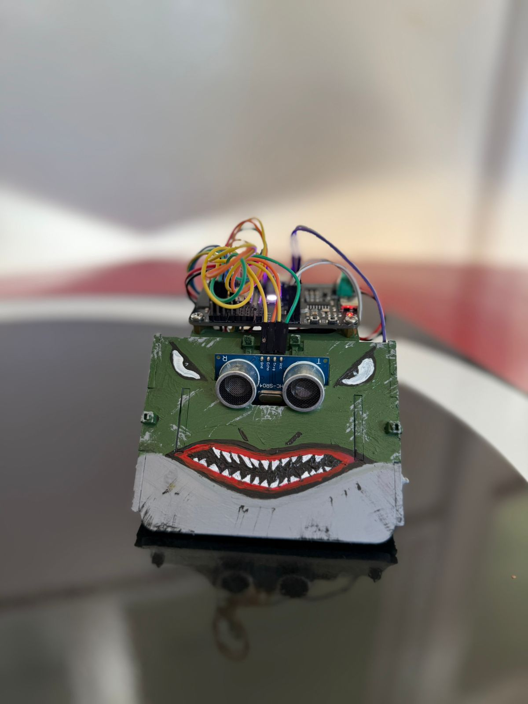

# 🥋 Mussolini — robot de sumo 2026

Robot de sumo autónomo hecho con el kit **Sumobot CENFOTEC 2025** (placa IdeaBoard, ESP32), para la
competencia de **Guanacaste 2026**. Acá está su código, cómo funciona y un simulador para probar
código sin el robot.



---

## ⭐ El código de Mussolini

### 👉 [`mussolini/`](mussolini) — es exactamente lo que corre hoy en el robot

**La forma más rápida, sin bajar nada:** abrir
[`mussolini/mussolini_completo.ino`](mussolini/mussolini_completo.ino) (botón **Raw**), copiar todo
y pegarlo en un sketch nuevo del IDE de Arduino.

También se puede bajar el repositorio entero (botón verde **Code → Download ZIP**) y abrir
**`mussolini/mussolini.ino`** — la otra pestaña (`giroscopio_control.ino`) se abre sola.

Instalar lo que falta y subirlo: [pasos en mussolini/README.md](mussolini/README.md#subirlo-al-robot).

---

## 🗂️ Qué hay en cada carpeta

| Carpeta | Qué tiene |
|---|---|
| [`mussolini/`](mussolini) | ⭐ **el código actual del robot**, cómo subirlo y cómo arrancarlo en el dojo |
| [`simulador/`](simulador) | un simulador del robot del kit que corre **cualquier** programa de Arduino o CircuitPython. Es un solo HTML: se abre con doble clic |
| [`docs/`](docs) | cómo está hecho el código y por qué: arquitectura, parámetros, pruebas, decisiones |
| [`diagnosticos/`](diagnosticos) | programas cortos para probar motores, sensores IR, sonar y giroscopio |
| [`versiones-anteriores/`](versiones-anteriores) | los códigos que vinieron antes, en CircuitPython y en Arduino |

---

## 🧠 Cómo pelea, en corto

```
1. ¿Veo el borde blanco?             → maniobra de escape según qué sensores lo ven
2. ¿Me están levantando?             → retroceder hasta volver a apoyar, y girar
3. ¿Me empujan de costado o golpean? → salir hacia adelante (si ve al rival, lo ataca)
4. Si no                             → buscar, perseguir y atacar
```

| Rival | Qué hace | LED |
|---|---|---|
| a menos de 40 cm | ataca a fondo, con el rumbo corregido por el giroscopio | 🔴 rojo |
| a 40–100 cm | lo persigue tanteando ±3° de lado a lado, para no perderlo del sonar | 🟠 naranja |
| perdido | lo busca girando hacia donde lo vio por última vez | 🔵 azul |

El detalle (borde, golpes, levantamiento, rondas, colores del LED) está en
[mussolini/README.md](mussolini/README.md#cómo-pelea).

---

## 🔧 Hardware

- **Placa:** IdeaBoard (ESP32), con el **core de ESP32 3.x**
- **Sensores:** 4 infrarrojos de línea, ultrasónico HC-SR05 al frente, giroscopio y acelerómetro
  LSM6DS3TRC (ya vienen en la placa del kit)
- **Motores:** 2 × Microgear 200 RPM · **Batería:** 4 × AA · **Peso:** menos de 315 g (reglamento)

Pines y mediciones: [docs/hardware.md](docs/hardware.md).

---

## 🗓️ Bitácora

| Fecha | Avance |
|---|---|
| — | Diagnósticos en CircuitPython (Thonny): motores, IR, ultrasónico, borde blanco |
| — | Códigos base y variantes de combate en CircuitPython |
| — | v5 en CircuitPython: calibración promediada, histéresis, ataque con verificación |
| — | Paso a Arduino: PWM a 20 kHz, impulso de arranque, motores invertidos, selección de ronda |
| — | Diagnóstico del giroscopio: confirmado el eje Z |
| 2026-08-30 | Firmware con giroscopio integrado |
| 2026-09-20 | Reescritura: maniobras que vigilan el borde, avance recto por giroscopio, anti-bucle, detección de empujes y golpes. Probado en 9 corridas reales |
| 2026-09-25 | Plan de correcciones sobre las capturas del Serial: sin corte por tiempo del ataque, giro trabado, `MODO_SIMPLE` |
| 2026-09-25 | Probado en el robot: "encarar" el golpe se quita (el arranque propio se leía como golpe por detrás); el golpe lateral vuelve a escapar hacia adelante |
| 2026-09-26 | Escapes de borde más decididos y cortables por el sonar, tanteo al perseguir, escape de golpes laterales cortable por el sonar, levantamiento que retrocede hasta volver a apoyar |
| 2026-09-27 | Simulador para cualquier programa del kit; documentación en `docs/` |
| 2026-09-27 | Repositorio reorganizado: el código actual en `mussolini/`. Comentarios del código resumidos (historia completa en `mussolini/HISTORIAL_DEL_CODIGO.md`). Barridos más amplios al perseguir (±10°, ±20°, ±45°) probados en el simulador y descartados |

---

## 👤 Autor

Juan D. Gutiérrez Sánchez

## 🤝 Compañero de equipo

[Sumobot-2026](https://github.com/str1k3rr-beep/Sumobot-2026) — el repositorio del robot de un compañero de la misma competencia.

## 📄 Licencia

Este proyecto se comparte con fines educativos y de documentación personal.
