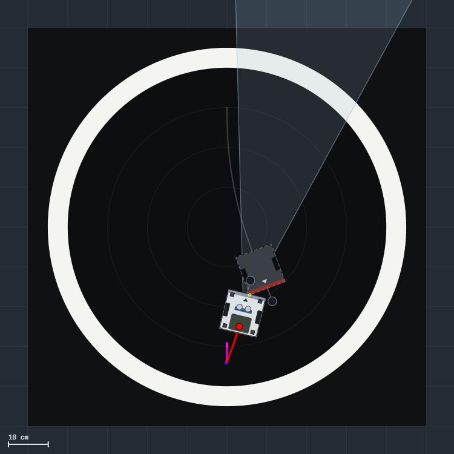

# Simulador de sumobot (kit IdeaBoard · ESP32)

Un simulador del robot de sumo del kit **Sumobot CENFOTEC** que corre **tu propio código**, sin
cambiarlo: el `.ino` de Arduino o el `code.py` de CircuitPython que subirías al robot. El
simulador lo traduce, lo corre con el mismo hardware (motores, sonar, 4 sensores IR, IMU,
botón BOOT, NeoPixel) y lo hace pelear en el dojo contra distintos rivales.

Sirve para probar una idea antes de subirla, para ver **por qué** el robot hizo algo (qué leyó
cada sensor, qué imprimió, qué variable cambió) y para comparar versiones peleando las 3 rondas
del reglamento con las mismas condiciones.



## Cómo usarlo

**No hay que instalar nada.** Es un solo archivo HTML que se abre en el navegador (Chrome, Edge o
Firefox) y funciona sin internet.

1. Descargá [`simulador.html`](simulador.html): abrilo en GitHub y tocá el botón **Download raw
   file** (la flecha hacia abajo, arriba a la derecha del archivo).
2. Abrilo con doble clic.
3. Arriba a la derecha está **Encender**. Arranca con un ejemplo: el robot se calibra, espera el
   BOOT de la salida y pelea contra una caja.

Para probar **tu** programa: en *Programa del robot* tocá **Cargar archivo…** y elegí tu `.ino`
(con sus `.h` y los otros `.ino` de la carpeta, si tiene varios) o tu `code.py`. También podés
**Pegar código…**, o abrir cualquier programa con **Ver y editar**, cambiar algo y probarlo al
instante. Tus programas quedan guardados en ese navegador.

> Si preferís no descargar nada, se puede publicar con GitHub Pages; ver al final.

## Qué muestra

- **El dojo visto desde arriba**: el robot, el rival, el cono del sonar (±15°) y su eco, el
  rastro con el color del LED, los sensores IR que pisan blanco y los puntos de contacto. Con la
  simulación en pausa se puede **arrastrar** el robot o el rival y girarlos con la manija.
- **Lo que ve el robot**: las órdenes de cada motor, la última medición del sonar, el IMU y las
  4 lecturas IR crudas (0–4095; blanco lee bajo, negro alto). Si tu programa tiene una variable
  que se llame `umbral…` con 4 números, la dibuja como raya roja en cada barra.
- **Variables del programa**: todas las variables globales, en vivo.
- **Informe**: lo que imprimió el programa, los cambios de LED, la calibración, las pruebas, el
  comienzo y el final del combate. Si tu programa imprime líneas `E,<ms>,<EVENTO>,<detalle>`
  (por ejemplo `E,5230,BORDE,frente`), aparecen como eventos y se cuentan.
- **Monitor serie**, igual que el del IDE.
- **Evaluar el programa**: pelea las 3 rondas del reglamento contra los rivales que elijas, con
  varias semillas, y da los puntos como en el torneo (gana 3, empata 1, pierde 0).

## Rivales

| Rival | Qué hace |
|---|---|
| Caja | un bloque de 300 g que se deja empujar |
| Pared | no se mueve (para probar giros y empujes) |
| Rival que embiste | sabe siempre dónde estás y te empuja: idealizado, sirve para producir empujes fuertes |
| Rival típico del kit | usa sus sensores como un programa común del kit: busca girando, embiste a menos de 60 cm, esquiva el borde por tiempo |
| Otro programa en el rival | cualquier programa (un ejemplo o uno tuyo) corriendo en el otro robot |

Las posiciones de salida son las del reglamento: ronda 1 frente a frente, ronda 2 de costado,
ronda 3 de espaldas.

## Cómo arranca un combate: el operador

En el robot real, alguien aprieta BOOT para calibrar, elegir la ronda y dar la salida. En el
simulador lo hace el **operador automático**: se da cuenta de que tu programa **espera el BOOT**
(lo lee una y otra vez sin mover los motores) y mira la última línea que imprimió:

| Si la línea dice… | el operador… |
|---|---|
| `negro` o `black` | sostiene los sensores sobre negro y aprieta BOOT |
| `blanco` o `white` | los sostiene sobre blanco y aprieta BOOT |
| `ronda` o `round` | aprieta BOOT tantas veces como la ronda elegida |
| cualquier otra cosa | aprieta BOOT una vez |

Antes de cada combate hace un **ensayo del arranque** para saber cuál de esas esperas es la
**salida**: la última antes de que el programa se ponga a pelear. El combate empieza al soltar
ese BOOT. El protocolo detectado aparece en *Programa del robot* (por ejemplo
`NEGRO → BLANCO → salida`).

Para que tu programa se entienda solo, alcanza con que **imprima qué espera** antes de esperar el
BOOT, como haría con una persona: `PASO 1: sensores sobre NEGRO y presiona BOOT`. Si tu
programa no espera el BOOT, el combate empieza al encender. También podés apagar el operador
automático y apretar BOOT vos.

## Hardware simulado

Los pines son los del kit IdeaBoard (se pueden cambiar en *Pruebas en combate → Pines del robot*):

| Función | Pin |
|---|---|
| Motor izquierdo IN1 / IN2 | 12 / 14 |
| Motor derecho IN1 / IN2 | 13 / 15 |
| Ultrasónico TRIG / ECHO | 25 / 26 |
| IR frontal izq. / der. | 36 / 39 |
| IR trasero izq. / der. | 34 / 35 |
| Botón BOOT | 0 |
| NeoPixel | 2 |
| IMU LSM6DS3TRC | I²C, dirección `0x6B` |

IN1 en alto hace **avanzar** la rueda. En CircuitPython, `motor_1` es el izquierdo y `motor_2` el
derecho, y `throttle` positivo avanza. Si tu robot está cableado al revés, marcá *Invertir*.

La física se ajustó contra mediciones de un robot real del kit: el pivote (~200 °/s a fondo; por
debajo de ~0,6 se traba, como en el robot), el desbalance entre motores (deriva 15–30 °/s sin
corrección), las lecturas IR del dojo brillante y del mate (con los reflejos del negro
brillante), el sonar (cono de ±15°, ecos perdidos que dejan ECHO en alto 38 ms) y el IMU (ejes,
ruido, vibración y sacudones al manejar). Lo que no está medido está en la sección *Qué es exacto
y qué es estimado* del propio simulador.

## Qué código entiende

**Arduino (C++ del IDE, core ESP32 2.x y 3.x).** Funciones, variables globales y locales,
`static`, arreglos (también de 2 dimensiones), `struct`, `enum`, `typedef`, referencias (`int &x`),
`#define` con argumentos, `#if`/`#ifdef`, varios `.ino` en la misma carpeta y `#include "tuyo.h"`.
Respeta los tipos de C: la división entre enteros trunca, un `byte` desborda en 255, asignar un
`float` a un `int` lo trunca, `String` funciona como el de Arduino (y `"texto" + numero` avisa,
porque en C++ eso no concatena). Además:

- `millis`, `micros`, `delay` (por ticks de FreeRTOS), `delayMicroseconds`, `pinMode`,
  `digitalWrite`/`Read`, `analogRead` (12 bits, `analogReadResolution`), `analogWrite`,
  `pulseIn`, LEDC del core 3.x (`ledcAttach` + `ledcWrite(pin, …)`) y del 2.x (`ledcSetup` +
  `ledcAttachPin` + `ledcWrite(canal, …)`), `neopixelWrite`, `map`, `constrain`, `random`,
  funciones de `math.h`, `sprintf`, `dtostrf`.
- `Serial.print`/`println`/`printf` con el formato exacto de Arduino, **a 115200 baudios de
  verdad**: si imprimís mucho, el programa se frena igual que en el robot.
- Librerías: **Adafruit NeoPixel**, **Adafruit LSM6DS** (`Adafruit_LSM6DS3TRC` y hermanas) y
  **Adafruit MPU6050** con `sensors_event_t`, **NewPing**, **HCSR04** (`UltraSonicDistanceSensor`)
  y `Wire` (el IMU responde en su dirección, con sus registros).

**CircuitPython.** Funciones con argumentos por nombre y por defecto, `global`, clases simples
con herencia y `super()`, listas, tuplas, diccionarios, conjuntos, comprensiones, `lambda`,
f-strings con formato, `%`, `try`/`except`/`finally`, `for`/`while` con `else`. Los errores salen
con su nombre de Python y su línea (`IndexError`, `ZeroDivisionError`, `ValueError: Throttle must
be None or between -1.0 and +1.0`, …). Módulos: `board`, `digitalio`, `analogio`, `pwmio`,
`time`, `random`, `math`, `keypad`, `neopixel`, `busio`, `ideaboard`, `hcsr04`, `adafruit_hcsr04`,
`adafruit_lsm6ds` (`lsm6ds3trc` y hermanas), `adafruit_motor`, `supervisor`, `gc`,
`microcontroller`, `sys`, `os`.

### Límites conocidos

- No hay clases propias en C++ (`class` con métodos), plantillas, `new`/`delete`, punteros a
  función ni interrupciones (`attachInterrupt` avisa y no hace nada). En Python no hay `yield`,
  `with` ni `async`.
- En CircuitPython un `float` con valor entero se imprime sin ".0" (`7` en vez de `7.0`).
- El tiempo de cada línea de CircuitPython es aproximado (unos µs por sentencia).
- No se simulan las pilas (caída de tensión), cables sueltos, WiFi ni Bluetooth, ni lo que haya
  fuera del dojo.

Si tu programa usa algo que el simulador no tiene, te lo dice con la línea, antes de correr.

## Ejemplos

En [`ejemplos/`](ejemplos) (los mismos que trae el simulador):

- [`1_sumo_basico.ino`](ejemplos/1_sumo_basico.ino): un sumo completo en Arduino y muy comentado:
  calibra, espera la salida, escapa del borde, busca y empuja.
- [`2_sumo_basico.py`](ejemplos/2_sumo_basico.py): lo mismo en CircuitPython con la librería del
  kit.
- [`3_giro_con_imu.ino`](ejemplos/3_giro_con_imu.ino): giros exactos con el giroscopio.

Cada uno tiene comentados los detalles que el simulador ayuda a descubrir: por qué hay que
confirmar el borde en dos lecturas (reflejos del dojo brillante), por qué mantener la última
distancia cuando el sonar pierde el eco pegado al rival, por qué buscar girando a 0,8 y no a 0,6.

## Para quien quiera estudiarlo o cambiarlo

Todo el código está en [`fuente/`](fuente), en JavaScript sin dependencias:

| Archivo | Qué hace |
|---|---|
| `nucleo/motor_a.js` | el mundo (física 2D del dojo, contactos, sonar, IR, IMU) y el hardware que ve el programa |
| `nucleo/traductor_arduino*.js` | preprocesador, parser de C++ y generador de JavaScript |
| `nucleo/api_arduino.js` | la API del ESP32 para los programas de Arduino |
| `nucleo/traductor_python*.js`, `nucleo/api_python.js` | lo mismo para CircuitPython |
| `nucleo/programas.js` | cómo se crea y se corre cada programa |
| `nucleo/motor_b.js` | el operador, el informe y la simulación completa |
| `ui.html`, `ui.js` | la página |

Los programas se traducen a **generadores** de JavaScript (`function*`): cada llamada que
espera tiempo (`delay`, una lectura, un bucle) cede el turno, y así el simulador avanza el mundo
en pasos de 250 µs y pausa el programa en cualquier punto sin cambiar su lógica.

Para armar el HTML después de cambiar algo (con [Node.js](https://nodejs.org)):

```
node fuente/construir.js
```

Y las pruebas de los traductores (comparan la salida del Serial con lo que da el robot real):

```
node fuente/pruebas/probar_traductores.js
node fuente/pruebas/probar_errores.js
node fuente/pruebas/correr.js ejemplos/1_sumo_basico.ino --rival=caja --ronda=2
```

## Publicarlo en línea (opcional)

Con GitHub Pages activado en el repositorio (Settings → Pages → rama `main`), el simulador queda
en `https://<usuario>.github.io/<repositorio>/simulador/simulador.html` y se abre sin descargar.
